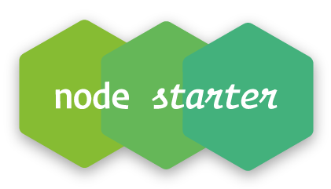

[![Contributors][contributors-shield]][contributors-url]
[![Forks][forks-shield]][forks-url]
[![Stargazers][stars-shield]][stars-url]
[![Issues][issues-shield]][issues-url]

<br />

<p align="center">
  

  <h3 align="center">NodeJS starter template</h3>

  <p align="center">
    Simple nodejs REST API preconfigure starter
    <br />
    <br />
    <a href="https://github.com/fernandobelotto/nodejs-crud/issues">Report Bug</a>
    <a href="https://github.com/fernandobelotto/nodejs-crud/issues">Request Feature</a>
  </p>
</p>

<details open="open">
  <summary>Table of Contents</summary>
  <ol>
    <li>
      <a href="#about-the-project">About The Project</a>
      <ul>
        <li><a href="#built-with">Built With</a></li>
      </ul>
    </li>
    <li>
      <a href="#getting-started">Getting Started</a>
      <ul>
        <li><a href="#prerequisites">Prerequisites</a></li>
        <li><a href="#installation">Installation</a></li>
      </ul>
    </li>
    <li><a href="#usage">Usage</a></li>
    <li><a href="#roadmap">Roadmap</a></li>
    <li><a href="#contributing">Contributing</a></li>
    <li><a href="#license">License</a></li>
    <li><a href="#contact">Contact</a></li>
    <li><a href="#acknowledgements">Acknowledgements</a></li>
  </ol>
</details>

## About The Project

This is an simple base project for creating rapid REST Api using NodeJS and Express.

### Built With

| Lib         | Version |
| ----------- | ------- |
| express     | 4.17.1  |
| body-parser | 1.19.0  |
| cors        | 2.8.5   |
| dotenv      | 8.2.0   |
| mysql       | 2.18.1  |
| mysql2      | 2.2.5   |
| pg          | 8.5.1   |
| pg-hstore   | 2.3.3   |
| sequelize   | 6.5     |

## Getting Started

This is an example of how you may give instructions on setting up your project locally.
To get a local copy up and running follow these simple example steps.

### Prerequisites

This is an example of how to list things you need to use the software and how to install them.

- npm

  ```sh
  npm install npm@latest -g
  ```

### Installation

1. Clone the repo

   ```sh
   git clone https://github.com/your_username_/Project-Name.git
   ```

2. Install NPM packages

   ```sh
   npm install
   ```

3. Run the app

   ```sh
   npm start
   ```

## Usage

Use this space to show useful examples of how a project can be used. Additional screenshots, code examples and demos work well in this space. You may also link to more resources.

_For more examples, please refer to the [Documentation](https://example.com)_

## Roadmap

See the [open issues](https://github.com/fernandobelotto/nodejs-crud/issues) for a list of proposed features (and known issues).

## Contributing

Contributions are what make the open source community such an amazing place to be learn, inspire, and create. Any contributions you make are **greatly appreciated**.

1. Fork the Project
2. Create your Feature Branch (`git checkout -b feature/AmazingFeature`)
3. Commit your Changes (`git commit -m 'Add some AmazingFeature'`)
4. Push to the Branch (`git push origin feature/AmazingFeature`)
5. Open a Pull Request

## License

Distributed under the MIT License.

## Contact

Fernando Belotto - [@ferbelottodev](https://twitter.com/ferbelottodev) - fernando.bbosco@gmail.com

Project Link: [https://github.com/fernandobelotto/nodejs-crud](https://github.com/fernandobelotto/nodejs-crud)

[contributors-shield]: https://img.shields.io/github/contributors/fernandobelotto/nodejs-crud.svg?style=for-the-badge
[contributors-url]: https://github.com/fernandobelotto/nodejs-crud/graphs/contributors
[forks-shield]: https://img.shields.io/github/forks/fernandobelotto/nodejs-crud.svg?style=for-the-badge
[forks-url]: https://github.com/fernandobelotto/nodejs-crud/network/members
[stars-shield]: https://img.shields.io/github/stars/fernandobelotto/nodejs-crud.svg?style=for-the-badge
[stars-url]: https://github.com/fernandobelotto/nodejs-crud/stargazers
[issues-shield]: https://img.shields.io/github/issues/fernandobelotto/nodejs-crud.svg?style=for-the-badge
[issues-url]: https://github.com/fernandobelotto/nodejs-crud/issues
